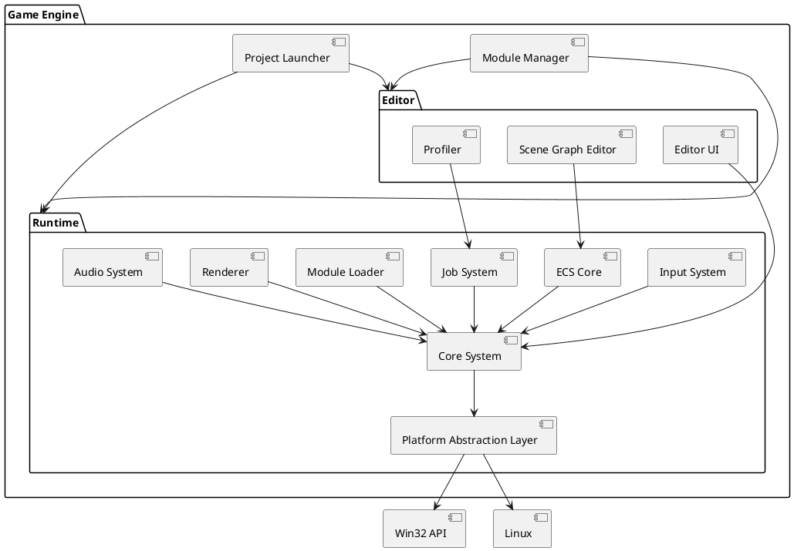

# SSS Engine

## Background

Modern game development demands engines that can handle photorealistic graphics, complex physics, and massive game
worlds, while maintaining real-time performance across a variety of hardware. 

This project aims to create a **general-purpose game engine architecture** with an emphasis on **extreme performance**.
It targets experienced game developers and studios looking for low-level control, customizability, and modularity
without the overhead of typical monolithic engines. The engine should support both 2D and 3D rendering, multithreading,
ECS (Entity Component System) architectures, and be extensible to support custom rendering pipelines, physics backends,
and scripting layers.

The architecture will be designed with modern C++ and offer direct access to system-level resources where necessary to
maximize performance. It will adopt best practices for high-performance focusing on minimal overhead, cache-aware data
layouts, and parallel execution.

***This is a WIP. As development goes this readme will get updated to represent the new ideas and changes. This is
purely a way to organize some ideas that I have for the engine and not final.***

## Motivation

Even though game engines are fairly well optimized and built decently, I think the overall direction we are going is not
the best. Instead of having great graphics with amazing performance we are chasing the barely noticeable graphic
improvements at the high cost of performance.

My goal is to create a simple game engine that will not feature any technology that does not support the high
performance metric. It's a game engine that will focus on the player experience above anything else. It's better to make
life harder for designers, artists, and coders if the end product is better for the consumer.

## Requirements

### Must Have

- Support for Windows and Linux platforms (runtime and development environments)
- Modular architecture with only the core systems included:
  - Rendering (DirectX and Vulkan backends)
  - Audio
  - Input
  - GUI
  - Reflection
  - Basic Game Components / Objects
  - Core ECS (Entity Component System) for game object management
- Runtime, editor, and project launcher should be separate binaries
- Built-in module manager to list/download modules from external sources (e.g., GitHub)
- High-performance multithreaded architecture (e.g., job system)
- Built-in asset pipeline tools (importers, converters)

### Should Have

- Abstract platform layer to enable future support for consoles
- Hot-reload support for code and assets

### Could Have

- Minimalistic scripting interface (e.g., Lua or WASM runtime)
- Default modules for common downloads like physics as separate installable packages
- Headless mode for server builds

### No plans to implement

- Web or mobile platform support or macOS
- Full-scale visual editor or node-based scripting UI (initially)
- Cloud-based multiplayer services

## Method

### High-Level Architecture Overview

The engine is divided into two core binaries:

- **Runtime**: The standalone game execution environment
- **Editor**: Development UI for world editing, asset management, profiling, etc.
- **Project Launcher**: CLI/GUI utility for creating, opening, and managing game projects

A strict separation ensures minimal overhead in runtime and clean module interfaces.



This layered architecture enforces modularity and high performance by minimizing interdependencies between systems and
allowing platform-specific code to be isolated in the Platform Abstraction Layer.

### Module System Design

Modules are compiled as **shared libraries** (`.dll` on Windows, `.so` on Linux) and loaded through the Module Loader.

Each module defines a plain C interface using function pointers (no virtual methods or inheritance) and registers itself
with the engine during initialization.

**Module API Structure**

```cpp
// module_api.h
typedef struct ModuleAPI {
    const char* name;
    uint32_t version;
    void (*initialize)(void* engineContext);
    void (*shutdown)();
    void (*update)(float deltaTime);
} ModuleAPI;

extern "C" ModuleAPI* GetModule();
```

**Module Lifecycle**

- The engine scans a designated modules folder at startup or on command.
- Loads modules via platform-specific dynamic loading APIs (`LoadLibrary` / `dlopen`).
- Calls `GetModule()` to register the module’s functionality.
- Core systems may query registered modules by name or capabilities.

**Advantages**

- No vtables or RTTI; avoids performance pitfalls of polymorphism.
- ABI-stable interface for loading across builds.
- Easy to sandbox or unload modules in editor context.

### ECS Core Design

The engine uses an **archetype-based ECS** with a **Struct-of-Arrays (SoA)** layout for optimal memory access and SIMD compatibility.

**Key Components:**

- **Entity Manager**: Issues unique IDs and tracks entity lifetimes.
- **Component Registry**: Auto-registers component types at static initialization time.
- **Archetype Storage**: Each unique component combination is stored in a tightly packed memory block.
- **Query System**: Iterates over archetypes matching the required component set using bitmask comparisons.

**Component Registration Macro**

```cpp
#define REGISTER_COMPONENT(Type) \
    static ComponentRegistration<Type> _auto_register_##Type(#Type);
```

**SoA Storage Example**

```cpp
struct ArchetypeChunk {
    uint8_t* component_data[MAX_COMPONENTS];
    size_t entity_count;
    size_t capacity;
};
```

**Benefits**

- Cache-friendly iteration through tight memory layouts
- SIMD-friendly data access
- Component addition/removal causes entity migration across archetypes
- No virtual methods; all dispatch is done through static indexing and function tables

### Job System Design

The engine features a **work-stealing job system** optimized for modern multi-core CPUs.

**Core Components:**

- **Worker Threads**: Each CPU core has a dedicated thread with its own task queue
- **Global Job Scheduler**: Distributes jobs and supports tagged execution
- **Work Stealing**: If a thread runs out of jobs, it steals from others
- **Job Handles**: Allow for synchronization and chaining (wait, then-execute)

**Job Definition Example**

```cpp
using JobFunction = void(*)(void*);

struct JobDesc {
    JobFunction function;
    void* data;
    uint32_t tag; // e.g., MAIN_THREAD, IO, RENDERING
};

JobHandle SubmitJob(const JobDesc& desc);
```

**Features:**

- Affinity/Tag-based dispatch (e.g., main thread only jobs)
- Fence and wait APIs for synchronization
- Job chaining to express dependencies
- No dynamic allocation during job execution

**Benefits:**

- Efficient CPU utilization across many threads
- Flexibility to tag or pin critical jobs
- Supports parallel ECS system execution

### Rendering System Design

The rendering system is abstracted behind a minimal, explicit API surface. Internally, two backends are supported: **DirectX 12** and **Vulkan**.

**Renderer Abstraction Layer**

- Provides a unified API for resource creation, command submission, and synchronization
- All platform-specific logic hidden behind thin driver interfaces
- Optimized for multithreaded command buffer generation

**Core Concepts**

- `RenderDevice` — interface to GPU, swapchains, resource allocators
- `RenderPass` — encapsulates a draw or compute workload
- `CommandBuffer` — records GPU work
- `Pipeline` — precompiled shader + state bindings
- `GPUResource` — memory-managed buffers and textures

**Rendering Features (MVP)**

- Deferred rendering with GBuffer layout
- Physically Based Rendering (PBR) support
- GPU-side culling and batching
- IMGUI overlay rendering for editor

**Design Goals**

- No runtime branching in critical render code
- All backend decisions made at initialization
- Avoid global state; renderer operates from explicit state packages
- Minimize API abstraction cost with zero-overhead C++ interfaces

## Implementation

### Project Layout

The basic layout will be as follows:

```
/thirdparty/      # Only headers or system APIs when absolutely needed
  /include/       # Headers
  /libs/          # Dlls, Static libraries
  CMakeLists.txt  # Handles dependencies
/engine/
  /base/          # Code not specific to a game engine e.g Lists, Arrays, Typing, etc.
  /core/          # ECS, Job System, Memory Allocator, ...
  /platform/      # Win32, Linux, Input, Timing
  /renderer/      # DX12 and Vulkan backends
  /editor/        # Separate binary using ImGui
  /launcher/      # Project Launcher and workspace manager
  /modules/       # Optional plug-ins and discovery tool
  CMakeLists.txt
```

Then each module will be like this:

```
# Example for core
/core/ 
  /.../         # Collection of folders like ECS, JobSystem, ...
    /include/   # Header files
    /internal/  # Optional folder with internal logic that should not leak out of this module (e.g core)
    /src/       # Cpp files
  CMakeLists.txt
```

As for namespaces they should at maximum nest 2 times and should be as an example SSSEngine{mainfolder}::{secondaryfolder}
e.g. SSSEngineCore::ECS.

### Build System

- Use **CMake** with separate targets for each module
- Define platform abstractions using `INTERFACE` targets
- Cross-compile support for Linux and Windows
- Different profiles based on the need for assertions, for editor and runtime

### Dependencies

- System APIs only (Win32, Linux, Vulkan SDK, DX12 SDK)
- This ensures the code is optimized for it's own use case
- This also allows me to explore and learn more about multiple software and game architecture

## Milestones

### Phase 1: Rendering using Directx12
### Phase 2: Editor GUI
### Phase 3: Input
### Phase 4: Audio
### Phase 5: Core Loop
### Phase 6: Project Launcher
### Phase 7: Module System
### Phase 8: Profiler and optimizations
### Phase 9: Implementing Linux and Vulkan 

## Gathering Results

To evaluate system performance and stability:

- Unit and integration tests for ECS, jobs, and rendering
- Module load/unload stress tests
- Profiling for frame time, memory usage, and CPU utilization
- Validate editor usability with test game projects
